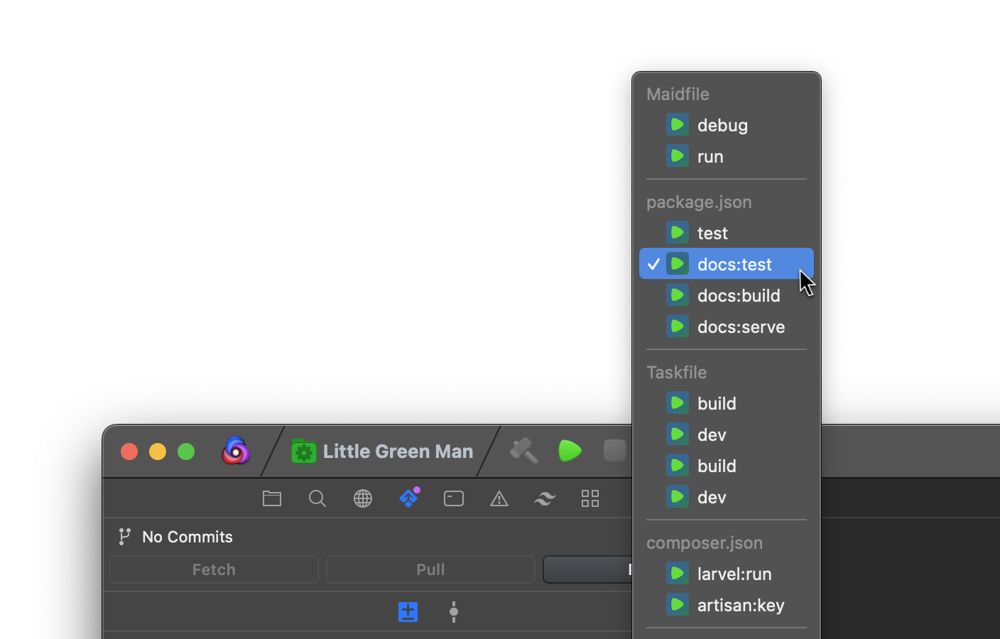

<a name="readme-top"></a>

<br />
<div align="center">
  <a href="https://github.com/little-green-man/nova-taskfinder">
    
  </a>

  <h3 align="center">Automatic Tasks - The ~~missing feature~~ best extension for Panic's Nova editor</h3>
</div>

<!-- TABLE OF CONTENTS -->
<details>
  <summary>Table of Contents</summary>
  <ol>
    <li>
      <a href="#about-the-project">About The Project</a>
      <ul>
        <li><a href="#built-with">Built With</a></li>
      </ul>
    </li>
    <li>
      <a href="#getting-started">Getting Started</a>
      <ul>
        <li><a href="#prerequisites">Prerequisites</a></li>
        <li><a href="#installation">Installation</a></li>
      </ul>
    </li>
    <li><a href="#usage">Usage</a></li>
    <li><a href="#roadmap">Roadmap</a></li>
    <li><a href="#contributing">Contributing</a></li>
    <li><a href="#license">License</a></li>
    <li><a href="#contact">Contact</a></li>
    <li><a href="#acknowledgments">Acknowledgments</a></li>
  </ol>
</details>

<!-- ABOUT THE PROJECT -->

## About The Project

This project is the source code for Little Green Man's [Automatic Tasks](https://extensions.panic.com/extensions/littlegreenman/littlegreenman.TaskFinder/) extension for Panic's Nova editor (phew). It was first established to plug holes that we had in our workflow, but addresses a key feature offered by most editors, and a great extension for Nova.
As the feature set grows, it becomes more obvious why Panic may leave this functionality out of Nova itself, but we'd sure appreciate support, review and PRs from them to make it the best it can be.

What does it do? In short, **auto-populate the editors tasklist with tasks from your project files** (Node, Composer, Maidfile and Taskfile at the moment). But also:

- Allows you to modify use of npm/yarn on a per-project basis
- Allows you to choose which features to enable (per-project also)
- Watches files to automatically update the task list on file changes

<p align="right">(<a href="#readme-top">back to top</a>)</p>

### Built With

This project was built with the following libraries and helpers.

- [TypeScript](https://www.typescriptlang.org/)
- [ESBuild](https://esbuild.github.io/)

<p align="right">(<a href="#readme-top">back to top</a>)</p>

<!-- GETTING STARTED -->

## Getting Started

If you just want to install the extension in Nova, then load Nova, load the Extension Library (shift-cmd-2), search for "Automatic Tasks" and press install.

Otherwise, to hack on it, develop it and/or load a local copy in Nova, carry on reading.

### Prerequisites

- nodejs
- yarn
- Nova

### Installation

1. Clone the repo
   ```sh
   git clone https://github.com/little-green-man/nova-taskfinder.git
   ```
2. Install NPM packages
   ```sh
   yarn
   ```
3. Build the extension
   ```sh
   yarn build
   ```
4. Activate the extension (Notes: First, disable the extension from Panic by unchecking it in the Extension Library. Second, minimise the window that opens for `./build/taskfinder.novaextension`, as you don't want to edit these files)
   ```sh
   nova extension activate ./build/taskfinder.novaextension
   ```
5. Edit the files in the `src`, run `yarn build`, and Nova will automatically reload the extension (from your minimised window)

<p align="right">(<a href="#readme-top">back to top</a>)</p>

<!-- USAGE EXAMPLES -->

## Usage

The [extension](https://extensions.panic.com/extensions/littlegreenman/littlegreenman.TaskFinder/) is submitted to the Panic Extension store by Little Green Man Ltd, following merged pull requests.

You just need to load Nova, load the Extension Library (shift-cmd-2), search for "Automatic Tasks" and press install.

Of course, if you fork the extension or prefer to submit your own variant, then you may do (having first modified the name, `build/extension.js` file, readme, changelog and more, choose `Extension > Submit to the Extension Library...` from Nova's menu).

<p align="right">(<a href="#readme-top">back to top</a>)</p>

<!-- ROADMAP -->

## Roadmap

- [x] Move to TypeScript
- [ ] Build testing in
- [ ] Find a solution to [#10](https://github.com/little-green-man/nova-taskfinder/issues/10)

See the [open issues](https://github.com/little-green-man/nova-taskfinder/issues) for a full list of proposed features (and known issues).

<p align="right">(<a href="#readme-top">back to top</a>)</p>

<!-- CONTRIBUTING -->

## Contributing

Contributions are what make the open source community such an amazing place to learn, inspire, and create. Any contributions you make are **greatly appreciated**.

If you have a suggestion that would make this better, please fork the repo and create a pull request. You can also simply open an issue with the tag "enhancement".
Don't forget to give the project a star! Thanks again!

1. Fork the Project
2. Create your Feature Branch (`git checkout -b feature/AmazingFeature`), make and test your changes
3. Commit your Changes (`git commit -m 'Add some AmazingFeature'`)
4. Push to the Branch (`git push origin feature/AmazingFeature`)
5. Open a Pull Request

<p align="right">(<a href="#readme-top">back to top</a>)</p>

<!-- LICENSE -->

## License

Distributed under the MIT License. See `LICENSE.txt` for more information.

<p align="right">(<a href="#readme-top">back to top</a>)</p>

<!-- CONTACT -->

## Contact

Elliot - [@elliot](https://social.lgm.ltd/@elliot), or hello [at] lgm.ltd

Project Link: [https://github.com/little-green-man/nova-taskfinder](https://github.com/little-green-man/nova-taskfinder)

<p align="right">(<a href="#readme-top">back to top</a>)</p>

<!-- ACKNOWLEDGMENTS -->

## Acknowledgments

So many thanks go to:

- [Sajjaad Farzad](https://github.com/theMackabu)
- [Reüel van der Steege](https://github.com/rvdsteege)

<p align="right">(<a href="#readme-top">back to top</a>)</p>
