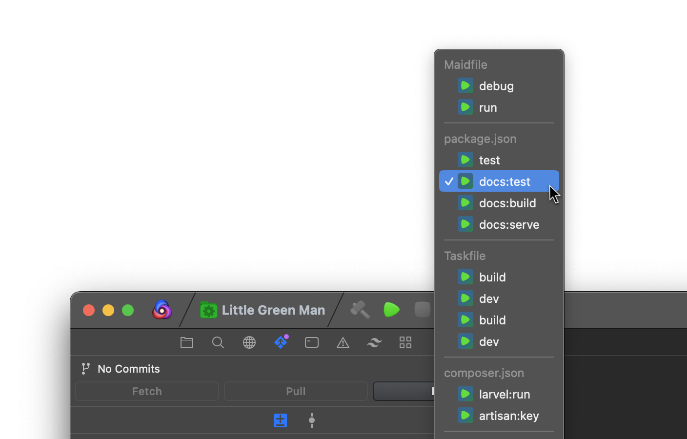

<a name="readme-top"></a>

<div align="center">
  

  <h1>Automatic Tasks for Nova</h1>

  <p><strong>Your project's scripts, in Nova's Tasks menu.</strong></p>

  <p>
    <a href="https://extensions.panic.com/extensions/littlegreenman/littlegreenman.TaskFinder/">Install from the Extension Library</a>
    ·
    <a href="CHANGELOG.md">Changelog</a>
    ·
    <a href="https://github.com/little-green-man/nova-taskfinder/issues">Issues</a>
  </p>
</div>

Automatic Tasks reads your project's task runners and lists their scripts in [Nova](https://nova.app)'s Tasks menu, ready to run with ⌘R. Open a project and the tasks are there; change a file or a setting and the list updates.

## Supported tools

| Source   | Reads                                                         | Runs                                   |
| -------- | ------------------------------------------------------------- | -------------------------------------- |
| Node     | `package.json` scripts                                        | `npm`, `yarn`, `pnpm` or `bun` (`run`) |
| Composer | `composer.json` scripts                                       | `composer run`                         |
| Task     | `Taskfile.yml` and its variants, including included Taskfiles | `task`                                 |
| Maid     | `maidfile`, `maidfile.toml`, `.yaml`, `.yml`, `.json`         | `maid`                                 |
| just     | `justfile` or `.justfile`, including modules                  | `just`                                 |
| Deno     | `deno.json` or `deno.jsonc` tasks                             | `deno task`                            |
| Make     | `Makefile` targets                                            | `make`                                 |
| Laravel  | `artisan` commands                                            | `php artisan`                          |
| VS Code  | `.vscode/tasks.json` `shell`, `process` and `npm` tasks       | each task's own command                |

## Features

- **Nothing to configure.** Tasks are read from the project's own files, at the top level of the project, and refresh when those files change.
- **Build and Clean shortcuts.** Scripts named `build` or `compile` also run with Build (⌘B), and `clean` with Clean (⇧⌘K).
- **The right package manager.** Node projects use npm, Yarn, pnpm or bun, detected from `packageManager`, `devEngines` or the lockfile, or chosen in Settings.
- **Monorepos.** Optionally list tasks from npm, Yarn, pnpm, bun and Deno workspace packages, each run in its own folder.
- **Only the tasks you run.** Lifecycle hooks such as `postinstall`, Composer events, private recipes and tasks that need arguments are left out.
- **Clear notifications.** A missing tool, a broken file or a task list that hangs is explained, with a button to fix it: Install, Open File, Settings or Turn Off.
- **VS Code tasks.** Projects with a `.vscode/tasks.json` get its tasks too, including `dependsOn` and the open file's `${file}` and `${fileDirname}`.
- **A Tasks sidebar.** Every task in one list: double-click to run, with live output and status.
- **Global or per project.** Every setting can be set once for all projects or overridden in Project Settings, and applies straight away.

## Install

In Nova, open **Extensions → Extension Library…** (⇧⌘2), search for **Automatic Tasks** and click **Install**. Or [install it from the Extension Library website](https://extensions.panic.com/extensions/littlegreenman/littlegreenman.TaskFinder/).

Each source needs its tool on your `PATH`: `task` (v3.19.1 or later), `maid`, `just` (1.15 or later), `make` or `php` to list tasks. Node, Composer and Deno tasks are read from their files, and need `npm` (or your package manager), `composer` or `deno` to run. For Maidfiles, use [theMackabu's maid](https://github.com/theMackabu/maid) (`cargo install maid`); npm's `maid` package is an unrelated tool.

> [!NOTE]
> Listing Make targets (by default) and Laravel commands runs some of the project's own code: the Makefile's `$(shell …)` and Laravel's service providers. For projects you don't trust, turn those sources off, or set Make to read the Makefile instead (see [Make](#make)).

## Tasks sidebar

The **Tasks** sidebar lists the same tasks as the Tasks menu, grouped by source. Show it like any other sidebar: it's listed alongside Files, Git and the rest.

- **Double-click** a task to run it, or right-click for **Run**, **Stop** and **Show Output**. Several tasks can run at once.
- Each task's icon and text show its status: running with the time so far, or how it finished ("✓ 3 s", "✗ exit 1", "stopped").
- Output streams into a log file named after the task, which opens when it starts. Close it whenever you like: **Show Output** opens it again. Each run replaces the last one's log, logs are cleared when the project is next opened, and a very long log (over 5 MB) keeps only its latest output.
- The header has **Refresh** and **Stop All**.

Nova doesn't let extensions start its own tasks, so the sidebar runs them itself. Those runs don't appear in Nova's task console or Issues, and the toolbar's Stop button doesn't stop them; use the sidebar's Stop instead. The Tasks menu and toolbar still work as before.

## Settings

Set preferences in **Extensions → Automatic Tasks → Settings**. Project Settings has the same settings for one project: each starts on **Use Global Setting**, which follows your preferences and shows their current value, e.g. "Use Global Setting (On)".

**Refresh Tasks** (a button in both panes, and in the Extensions menu) re-reads every source. Use it after installing a missing tool, such as `just` or `deno`.

### Task Sources

Turn each kind of task on or off. A source is only read when the project has its file at the top level. If the tool a source needs isn't installed, or its file has an error, a notification explains what to do.

### Node and Composer

- **Package Manager:** **Automatic** uses the `packageManager` field in `package.json`, then `devEngines.packageManager`, then the lockfile (bun, pnpm, Yarn, then npm), and otherwise npm. Choose one to always use it.
- **Show Lifecycle Scripts:** off by default. npm and Composer run some scripts for you: npm's install, publish and version hooks, `pre`/`post` scripts for another script (when your package manager runs them), and Composer events such as `post-install-cmd`. Turn this on to list them too.

### Monorepos

- **Workspace Packages:** off by default. When on, tasks from workspace packages are listed as `<package>: <script>`, e.g. `@acme/api: build` (or the folder, if a package has no name), and run in the package's folder with the project's package manager.
  - Workspaces are read from `package.json` `workspaces` (npm, Yarn, bun), `pnpm-workspace.yaml` `packages` and `deno.json` `workspace`.
  - Patterns can use `*`, `**` and `!` exclusions; `node_modules` and hidden folders are skipped.
  - A package's `build` and `clean` scripts also run with Build and Clean.

### Taskfile

- **Task Flags:** empty by default. Added before each task's name, e.g. `--output=prefixed` labels each line with its task, and `--output=group` shows each task's output once it finishes (so a long-running task such as a server shows nothing until it stops). A project can set the same with `output:` in its Taskfile.

### Maid

- **maid Path:** leave empty to use `maid` from your `PATH`. If a different `maid` comes first on your `PATH`, set this to theMackabu's maid, e.g. `~/.cargo/bin/maid`. The "A different maid is installed" notification's **Settings** button opens this.

### just

- **Recipes That Ask to Confirm:** recipes marked `[confirm]` ask a question before running, which a Nova task can't answer. **Hide** leaves them out; **Show, and confirm when run** lists them and runs them with `just --yes`.

### Make

- **Find Targets By:**
  - **Asking make** (the default) uses make's own list, so it finds every target, including those in included files. To do this, make evaluates the Makefile, running any `$(shell …)` in it.
  - **Reading the Makefile** reads the Makefile and the files it includes by name, and runs nothing.
  - Either way, `.PHONY` targets are listed if the Makefile declares any; otherwise, targets that look like names rather than files or patterns.
- **Parallel Jobs:** **One at a time** (the default) runs `make <target>`. **One per CPU core** runs `make -j$(sysctl -n hw.ncpu) <target>`, which is faster for big builds, but Makefiles with missing dependencies may fail or build in the wrong order.
- **Make Flags:** added before each target. The default, `--output-sync=target`, keeps each target's output together when jobs run in parallel. It's only passed with **One per CPU core** and GNU make 4.0 or later; macOS's own make is 3.81, so install a newer one (e.g. `brew install make`, then put its `gnubin` folder first on your `PATH`) to use it. It holds back each target's output until that target finishes, so for long-running targets such as `make serve`, use `--output-sync=line` instead.

### Laravel

- **Artisan Commands:**
  - **Common** lists everyday commands (`serve`, `test`, `migrate`, `migrate:fresh`, `migrate:rollback`, `migrate:status`, `db:seed`, `queue:work`, `queue:listen`, `schedule:work`, `schedule:run`, `pail`, `optimize`, `optimize:clear`, `route:list`, `about`, `storage:link`) plus every `app:` command.
  - **All** lists every command that needs no arguments.
  - Commands that need a terminal (`tinker`, `dev`) are never listed.
  - Listing starts the Laravel app, which runs your project's code; turn the source off for projects you don't trust.

### VS Code

Tasks come from `.vscode/tasks.json` (comments and trailing commas are fine):

- **Types:** `shell` and `process` tasks run their command and arguments; `npm` tasks run their script with the project's package manager (see Package Manager, above), in `path` if given. Types from VS Code extensions (gulp, grunt, TypeScript…) are skipped.
- **Build group:** tasks in the `build` group also run with Build (⌘B).
- **Options:** `options.cwd` and `options.env`, top-level defaults and `osx` overrides apply. Tasks with `hide: true` aren't listed, but still run as dependencies.
- **`dependsOn`:** dependencies run first, together (`parallel`, the default) or one after another (`"dependsOrder": "sequence"`), then the task's own command. A failure stops the rest.
- **Variables:** `${workspaceFolder}`, `${workspaceFolderBasename}`, `${userHome}`, `${env:NAME}` and `${/}` are filled in when tasks are listed. Tasks using the open file (`${file}`, `${fileDirname}`, `${relativeFile}`, `${lineNumber}`, `${selectedText}` and the like) are filled in when they run, from the frontmost editor; with no file open, they say so. Tasks using `${command:…}`, `${config:…}` or `${input:…}` need VS Code, so they're skipped.

Skipped tasks are listed, with the reason, in the Extension Console.

## Development

You'll need [Nova](https://nova.app), [Node.js](https://nodejs.org) 22 or later and [Yarn](https://classic.yarnpkg.com) 1.

```sh
git clone https://github.com/little-green-man/nova-taskfinder.git
cd nova-taskfinder
yarn              # install dependencies
yarn build        # or `yarn watch` to rebuild on every change
yarn activate     # load the build in Nova as a development extension
```

Before running `yarn activate`, disable the Extension Library copy of Automatic Tasks. Leave the window that opens for `build/taskfinder.novaextension` minimised; Nova reloads the extension from it after each build.

| Command                                                  | What it does                                                  |
| -------------------------------------------------------- | ------------------------------------------------------------- |
| `yarn test`                                              | Unit and source tests; no tools need to be installed          |
| `yarn lint`                                              | Type checks with TypeScript                                   |
| `yarn format`                                            | Formats the code with Prettier (`yarn format:check` to check) |
| `yarn pop-tests`                                         | Opens every test project in `tests/projects/` in Nova         |
| `nova extension validate build/taskfinder.novaextension` | Validates the extension before release                        |

[`DESIGN.md`](DESIGN.md) explains how the extension works, the Nova quirks it works around, and how to add a new source. [`tests/README.md`](tests/README.md) lists what each test project should show.

## Contributing

Bug reports, ideas and pull requests are welcome. Planned work and known issues are in [GitHub issues](https://github.com/little-green-man/nova-taskfinder/issues).

For a pull request:

1. Fork the repository and create a branch from `master`.
2. Make your change, with tests where it changes behaviour (see [`DESIGN.md`](DESIGN.md) → Testing).
3. Run `yarn format`, `yarn lint` and `yarn test`, and check the change in Nova with `yarn activate`.
4. Open a pull request describing the change. CI runs the same checks, and must pass before merging.

If you publish your own variant of the extension, change its name and identifier in `build/taskfinder.novaextension/extension.json` first.

### Adding a source

Each source (Node, Composer, Task…) is a short **definition** in `src/parsers/`. A shared pipeline (`src/source.ts`) does the rest:

- finds the source's file at the top of the project;
- checks its tool is installed;
- lists the tasks, stopping after 15 seconds;
- shows a notification if something's wrong, with buttons to fix it;
- adds the tasks to Nova, with Build and Clean for `build` and `clean`.

As a worked example, suppose a tool called `mytool` keeps its tasks in `mytool.yml`, and `mytool list --json` prints `{"tasks": ["build", "test"]}`.

**1. Write the definition**, `src/parsers/mytool.ts`:

```ts
import { errorDetail } from '../diagnose';
import { run } from '../process';
import { cliAssistant } from '../source';
import type { CliSource } from '../source';

export const mytoolFiles = ['mytool.yml'];

export const mytoolSource: CliSource = {
	id: 'mytool', // used in logs and notification ids (mytool-missing, mytool-error…)
	names: { tool: 'mytool', file: 'a mytool.yml', listing: 'mytool tasks', noun: 'tasks', turnOff: 'reading mytool.yml' },
	rootFiles: mytoolFiles, // the files that mean a project uses mytool
	settingKey: 'taskfinder.auto-mytool', // the on/off setting, for the notifications' Turn Off button
	installKey: 'mytool', // its install link, in installUrls (src/notify.ts)
	tool: { command: 'mytool', needed: 'list' }, // listing needs mytool, so it's checked first

	async list() {
		const result = await run('mytool', ['list', '--json']);
		if (result.timedOut) return { kind: 'timeout' };
		try {
			const tasks: string[] = JSON.parse(result.stdout).tasks;
			return { kind: 'ok', tasks: tasks.map((name) => ({ name, command: 'mytool', args: ['run', name] })) };
		} catch {
			return { kind: 'error', detail: errorDetail(result.stderr, 'mytool failed to list its tasks') };
		}
	},
};

export default cliAssistant(mytoolSource);
```

A source that reads its file directly, without running a tool (like Node or Deno), is a `FileSource` with a synchronous `list()` and `fileAssistant()`. Keep parsing and decisions in the pure modules (`src/recipes.ts`, `src/diagnose.ts`) where they can be unit-tested.

**2. Register it.** Export it from `src/parsers/index.ts`, then add it to `src/features.ts`:

```ts
feature(mytoolSource, MytoolParser, {
	name: 'mytool (mytool.yml)', // the Tasks menu heading; matches the setting's title
	globs: ['*mytool.yml'], // what Nova watches
	files: mytoolFiles, // changes to these reload the tasks
	id: 'taskfinder-tasks-mytool',
}),
```

**3. Add its settings** in `build/taskfinder.novaextension/extension.json`:

- an `onWorkspaceContains:mytool.yml` activation event;
- `taskfinder.auto-mytool` in **Task Sources**, in both `config` (a boolean, default `true`) and `configWorkspace` (a pop-up with `resolve`);
- its choices in `src/settings.ts`.

The tests check that all of these stay in step.

**4. Add its install link** to `installUrls` in `src/notify.ts`. The "isn't installed", "has an error" and "took too long" notifications then work automatically.

**5. Test it.** Capture real output from `mytool` (success and failure) into `tests/fixtures/`, and add a test in `tests/unit/parsers/`. The stand-in Nova in `tests/unit/nova.ts` runs your source without Nova or `mytool` installed:

```ts
test('mytool: lists tasks', async () => {
	useProject('mytool-only'); // tests/projects/mytool-only/mytool.yml
	install('mytool');
	script('mytool list --json', { stdout: fixture('mytool-list.json') });
	assert.deepEqual((await new MytoolParser().provideTasks()).map(summarise), [
		['build', 'run+build', 'mytool run build'],
		['test', 'run', 'mytool run test'],
	]);
});
```

Add a test project in `tests/projects/` (and a broken one) with a row in [`tests/README.md`](tests/README.md), then try it in Nova with `yarn pop-tests`.

**6. Document it:** a row in both READMEs' Supported tools tables, any settings in the Settings sections, and a line in `CHANGELOG.md`.

The full checklist, and the Nova quirks behind these conventions, are in [`DESIGN.md`](DESIGN.md) → Adding a source.

## Licence

MIT. See [`LICENSE.txt`](LICENSE.txt).

## Acknowledgements

Made by [Little Green Man](https://lgm.ltd), with thanks to:

- [Sajjaad Farzad](https://github.com/theMackabu)
- [Reüel van der Steege](https://github.com/rvdsteege)
- [Toni Förster](https://github.com/stonerl)

Questions or feedback: Elliot, on Mastodon ([@elliot@rtsn.dev](https://rtsn.dev/@elliot)) or Bluesky ([@elliotali.com](https://bsky.app/profile/elliotali.com)), or hello [at] lgm.ltd.
